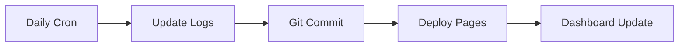

# GitPulse - Daily Commit Dashboard

[](https://github.com/features/actions)
[](https://pages.github.com/)
[](#long-term-reliability)
[](https://opensource.org/licenses/MIT)

> A beautiful, automated GitHub Actions dashboard that tracks your coding consistency and builds lasting habits. Features real-time activity heatmaps, streak tracking, and colorful visualizations - all updating automatically for years without maintenance.

## Features

- **🎨 Beautiful Dashboard** - Colorful gradients, smooth animations, mobile-responsive design
- **📊 Activity Heatmap** - 90-day GitHub-style contribution graph with proper color coding
- **🔥 Streak Tracking** - Current streak, best streak, total commits, and success rate
- **🤖 Fully Automated** - Daily commits at 2:00 AM UTC + automatic dashboard updates
- **🌐 GitHub Pages Ready** - Zero-config deployment with intelligent data loading
- **📱 Mobile Optimized** - Responsive design that works perfectly on all devices
- **🛠️ Self-Healing** - Error recovery, data validation, and automatic maintenance
- **⚡ Lightning Fast** - Loads in milliseconds with optimized performance

## Quick Start

### Prerequisites

- GitHub account
- Public repository (or GitHub Pro for private repositories)

### Installation

1. **Fork or clone this repository**
   ```bash
   git clone https://github.com/yourusername/gitpulse-dashboard.git
   cd gitpulse-dashboard
   ```

2. **Enable GitHub Pages**
   - Go to repository **Settings** → **Pages**
   - Set **Source** to "GitHub Actions"

3. **Configure workflow permissions**
   - Go to **Settings** → **Actions** → **General**
   - Select "Read and write permissions"
   - Enable "Allow GitHub Actions to create and approve pull requests"

4. **Deploy**
   ```bash
   git push origin main
   ```

Your dashboard will be live at: `https://[username].github.io/[repository-name]`

## Dashboard Overview

### Key Metrics
| Metric | Description | Visual |
|--------|-------------|--------|
| Current Streak | Days of consecutive commits | Orange gradient card |
| Total Commits | All automated commits | Green gradient card |
| Best Streak | Longest consecutive period | Purple gradient card |
| Success Rate | Percentage of active days | Pink gradient card |

### Activity Visualization
- **Heatmap Display**: 90 days (desktop) / 42 days (mobile)
- **Color Coding**: GitHub-style green progression
- **Interactive Elements**: Hover tooltips with date details
- **Responsive Design**: Adapts to all screen sizes

### Data Sources
- **Production**: Loads from log files via GitHub API
- **Development**: Uses Python server endpoints
- **Fallback**: Demo data for testing environments

## Architecture

### Technology Stack
- **Frontend**: Vanilla JavaScript, CSS Grid/Flexbox, SVG graphics
- **Backend**: GitHub Actions, Python (development)
- **Storage**: File-based logs in Git repository
- **Hosting**: GitHub Pages with automatic deployment

### Workflow Process


1. **Trigger**: Daily cron job at 2:00 AM UTC
2. **Process**: Update activity logs and streak counters
3. **Commit**: Atomic commit with retry logic
4. **Deploy**: Automatic GitHub Pages deployment
5. **Update**: Dashboard reflects new data immediately

## Long-term Reliability

### Self-Maintenance Features
- **Error Recovery**: Automatic retry logic for failed operations
- **Data Validation**: Streak count validation with auto-reset
- **Size Management**: Log rotation (keeps last 1000 entries)
- **Timeout Protection**: 10-minute workflow timeout prevents hanging

### Resource Usage
- **GitHub Actions**: <3% of free tier quota (60 minutes/month)
- **Storage**: ~365 KB growth per year
- **Dependencies**: Zero external APIs or services
- **Maintenance**: Completely automated operation

### Monitoring
- View workflow status in repository **Actions** tab
- Dashboard displays real-time operational status
- Optional email notifications for failures
- Complete audit trail in Git history

## Project Structure

```
├── index.html                    # Main dashboard page
├── dashboard.css                 # Styles and animations
├── dashboard.js                  # Interactive functionality
├── server.py                     # Local development server
├── _config.yml                   # GitHub Pages configuration
├── .github/
│   └── workflows/
│       └── daily-commit.yml      # Automation workflow
├── logs/                         # Auto-generated data
│   ├── daily-activity.log        # Activity history
│   ├── streak-count.txt          # Current streak
│   └── last-update.txt           # Latest timestamp
├── docs/                         # Documentation
│   ├── DEPLOYMENT.md
│   ├── LONG_TERM_MAINTENANCE.md
│   └── setup-github-pages.md
└── README.md                     # This file
```

## Configuration

### Scheduling
Modify the workflow trigger in `.github/workflows/daily-commit.yml`:
```yaml
on:
  schedule:
    - cron: '0 2 * * *'  # Daily at 2:00 AM UTC
```

Common schedules:
- `'0 6 * * *'` - 6:00 AM UTC daily
- `'0 12 * * 1-5'` - Noon UTC on weekdays
- `'30 0 * * *'` - 12:30 AM UTC daily

### Customization
| Component | File | Purpose |
|-----------|------|---------|
| Colors/Themes | `dashboard.css` | Gradient colors, animations |
| Content | `index.html` | Titles, labels, footer |
| Data Processing | `dashboard.js` | Metrics calculation |
| Workflow Logic | `daily-commit.yml` | Automation behavior |

## Development

### Local Setup
```bash
git clone https://github.com/yourusername/gitpulse-dashboard.git
cd gitpulse-dashboard
python server.py
```
Dashboard will be available at `http://localhost:5000`

### Testing
- **Manual Trigger**: Use "Run workflow" button in Actions tab
- **Validation**: Check logs directory for generated files
- **Dashboard**: Verify metrics display correctly

## Troubleshooting

| Issue | Solution |
|-------|----------|
| Dashboard not loading data | Verify GitHub Pages source is "GitHub Actions" |
| Workflow failing | Check "Read and write" permissions in Actions settings |
| Missing log files | Ensure workflow has repository write access |
| Incorrect metrics | Manually trigger workflow to reset data |

### Common Issues
- **Permission errors**: Enable "Read and write permissions" in repository settings
- **Branch protection**: Ensure workflow can commit to main branch
- **GitHub Pages**: Must be enabled with "GitHub Actions" source

For detailed troubleshooting, see [LONG_TERM_MAINTENANCE.md](LONG_TERM_MAINTENANCE.md)

## Contributing

Contributions are welcome! Please feel free to submit a Pull Request. For major changes, please open an issue first to discuss what you would like to change.

## License

This project is licensed under the MIT License - see the [LICENSE](LICENSE) file for details.

## Acknowledgments

- Built with GitHub Actions and GitHub Pages
- Inspired by GitHub's contribution graph
- Designed for long-term automated operation

---

<div align="center">

**Set it up once, enjoy forever!**

[🚀 Deploy to GitHub Pages](https://docs.github.com/en/pages) • [📖 Documentation](DEPLOYMENT.md) • [🛠️ Maintenance Guide](LONG_TERM_MAINTENANCE.md)

</div>